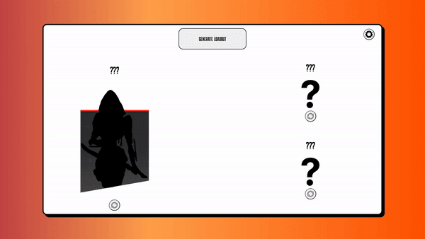
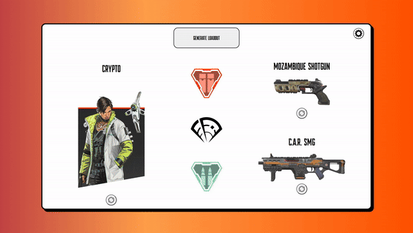
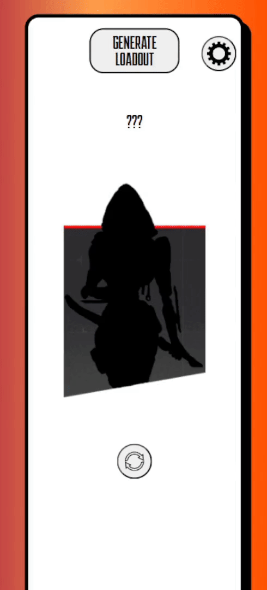

<h1>Apex Randomizer</h1>

<h2>Customize Randomizer to Desired Settings</h2>

<h2>Responsiveness for Moblie</h2>

<h2>Learned</h2>
<ul>
  <li>Basic PostgreSQL</li>
  <li>SpringBoot</li>
    <ul>
      <li>Implementation of requests to different layers </li>
      <li>Usage with PostgreSQL</li>
      <li>RESTful APIs with given status codes from ResponseEntity</li>
    </ul>
</ul>
<h2>Future Improvements</h2>
<ul>
  <li>Drop Location Picker</li>
</ul>
